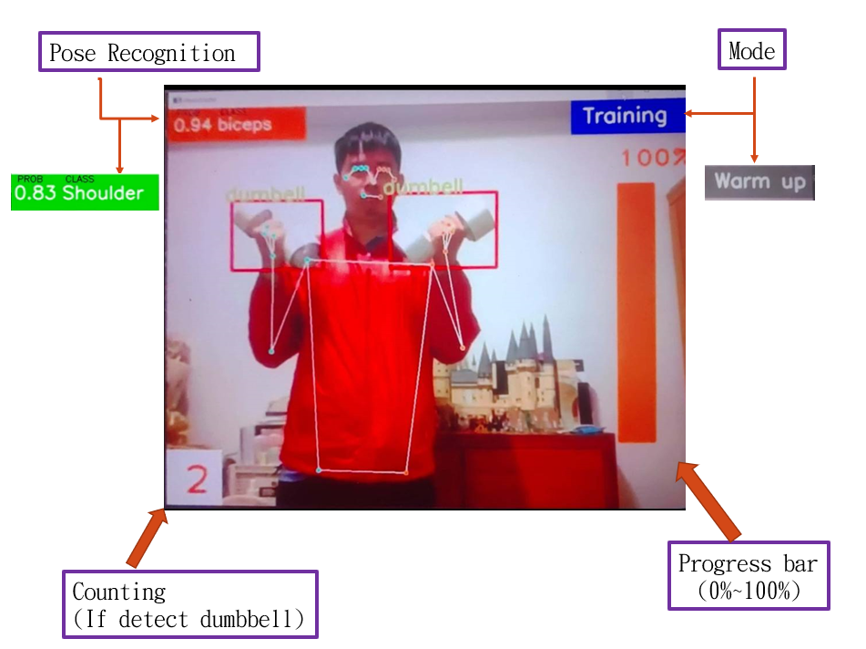
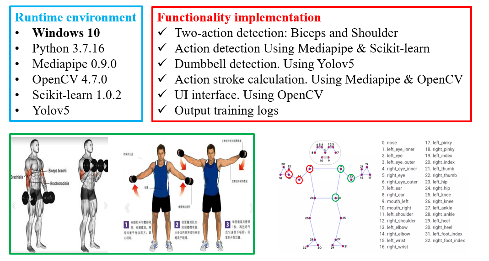

# [Project] AI Trainer
## Introduction
*自動辨識健身動作與偵測手上有無提取啞鈴並自動記錄動作次數的AI程式* 
*目前支援的健身動作*
1. **啞鈴側平舉**
   - 針對三角肌中束的訓練動作，是三角肌必練的經典動作 
   - 直立站著或是坐著，手拿啞鈴貼於身體兩側 
   - 維持脊椎的直立，將核心穩固好再來將兩隻手臂往上平舉，直至你的手臂與地面平行，手肘略微彎曲不要鎖死。 
2. **啞鈴二頭彎舉**
   - 針對二頭肌的訓練動作 
   - 雙手反握啞鈴或槓鈴，兩手間距約同比肩寬，將啞鈴或槓鈴下放垂於腿前。 
   - 上臂內側緊貼身體。以肘關節為支點，用二頭肌的力量，將向上舉起至肩前。 
   
## Environment
- Windows 10
- Python 3.7.16
- Mediapipe 0.9.0
- OpenCV 4.7.0
- Scikit-learn 1.0.2
- Yolov5

## User Interface

## Features
- [x] 三角肌訓練
- [x] 二頭肌訓練
## Implementation
- Two-action detection: Biceps and Shoulder 
- Action detection Using Mediapipe & Scikit-learn 
- Dumbbell detection. Using Yolov5 
- Action stroke calculation. Using Mediapipe & OpenCV 
- UI interface. Using OpenCV 
- Output training logs 

## Summary

